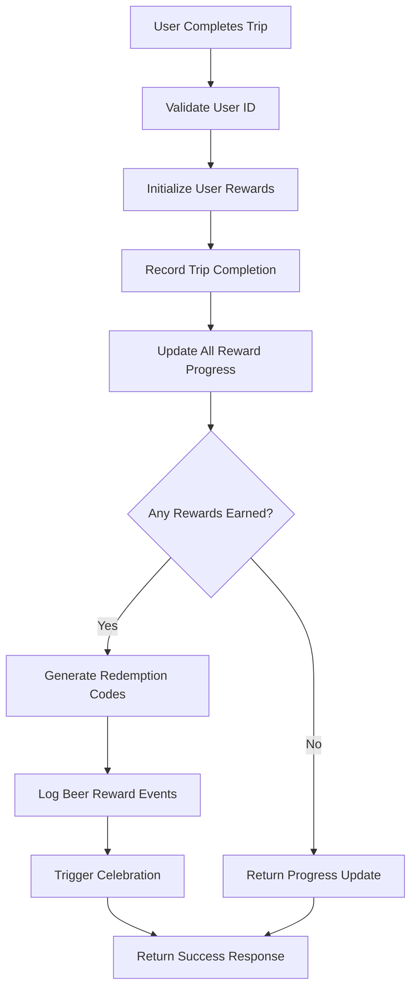
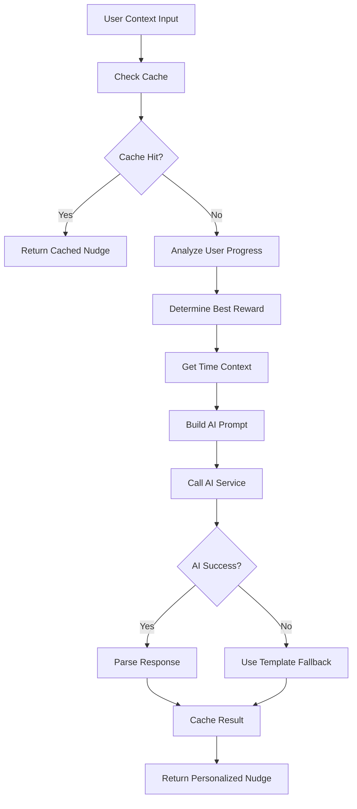
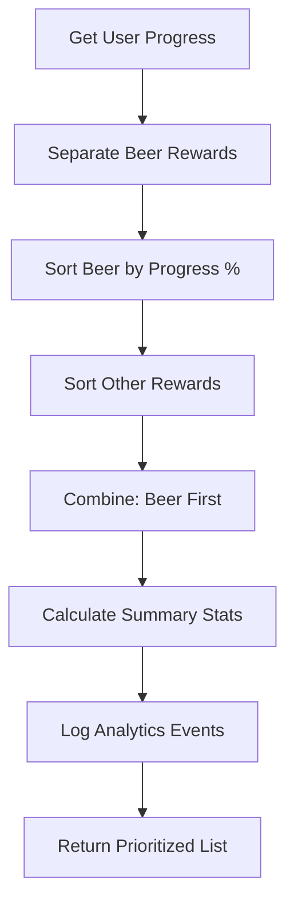

# Kiro Business Logic Analysis - Tryp Transit Application
**Generated:** 2025-08-04 22:32:47  
**Analysis Type:** Business Rules and Domain Logic Analysis

## Business Domain Overview

Tryp Transit operates in the intersection of public transportation, behavioral economics, and AI-powered recommendations. The application implements sophisticated business logic to encourage transit adoption through gamified rewards, personalized messaging, and real-time insights.

## Core Business Models

### 1. Transit Insights Business Logic

#### Value Proposition Engine
```typescript
// Core value calculation logic
interface TransitInsightResponse {
  travelTime: number | null;           // Competitive advantage metric
  trafficDensity: 'Light' | 'Medium' | 'Heavy';  // Context for recommendations
  costSavingsPerTrip: string | null;   // Financial incentive
  nudgeMessage: string | null;         // Behavioral trigger
  incentiveDetails: IncentiveDetails;  // Reward mechanism
}
```

#### AI-Powered Recommendation Engine
```typescript
// Business logic for personalized recommendations
const prompt = `You are a transit optimization assistant...
TASK: Create compelling transit insights that:
1. Highlight specific benefits (time, stress, money saved)
2. Consider traffic conditions and timing
3. Provide tangible incentives
4. Use behavioral psychology principles`;
```

#### Time-Based Optimization
```typescript
// Business rule: Prediction accuracy vs. time horizon
const hours_until_destination = Math.max(0, Math.floor(
  (destinationTime.getTime() - now.getTime()) / (1000 * 60 * 60)
));

if (hours_until_destination > 48) {
  console.warn(`Long prediction horizon: ${hours_until_destination} hours. Accuracy may be reduced.`);
}
```

### 2. Rewards System Business Logic

#### Reward Tier Strategy
```typescript
// Strategic reward positioning
enum RewardType {
  ECREDIT = "ECREDIT",           // Entry level: $0.50-$2.00
  FREE_COFFEE = "FREE_COFFEE",   // Daily habit: $3-$5 value
  FREE_APPETIZER = "FREE_APPETIZER", // Social dining: $6-$8 value
  FREE_BEER = "FREE_BEER"        // Flagship premium: $5-$7 value
}
```

#### Threshold Business Rules
```typescript
// Business logic: Trip requirements by reward type
interface RewardThreshold {
  rewardType: RewardType;
  requiredTrips: number;
  estimatedValue: string;
  rationale: string;
}

// Implementation in seed data
const rewardThresholds = [
  { type: 'ECREDIT', trips: 3, value: '$3', rationale: 'Entry-level habit formation' },
  { type: 'FREE_COFFEE', trips: 5, value: '$3-5', rationale: 'Daily commute reinforcement' },
  { type: 'FREE_APPETIZER', trips: 6, value: '$6-8', rationale: 'Social dining engagement' },
  { type: 'FREE_BEER', trips: 7, value: '$5-7', rationale: 'Premium flagship, maximum memorability' }
];
```

#### Progress Calculation Logic
```typescript
// Core business rule: Progress tracking and reward earning
const newCompletedTrips = progress.completedTrips + 1;
const isNowEarned = newCompletedTrips >= progress.reward.requiredTrips;

if (isNowEarned) {
  updateData.isEarned = true;
  updateData.earnedAt = new Date();
  updateData.redemptionCode = this.generateRedemptionCode(progress.reward.rewardType);
  updateData.expiresAt = new Date(Date.now() + 30 * 24 * 60 * 60 * 1000); // 30 days
}
```

### 3. Behavioral Economics Implementation

#### Time-Contextual Messaging
```typescript
// Business logic: Optimal timing for beer rewards
export function getBeerNudgeContext(currentTime: Date = new Date()): BeerNudgeContext {
  const hour = currentTime.getHours();
  const dayOfWeek = currentTime.getDay();
  
  // Friday evening (after 3 PM) - HIGHEST PRIORITY
  if (dayOfWeek === 5 && hour >= 15) {
    return { contextType: 'TGIF_HAPPY_HOUR', isOptimalBeerTime: true };
  }
  // Weekend anytime - HIGH PRIORITY  
  else if (dayOfWeek === 0 || dayOfWeek === 6) {
    return { contextType: 'WEEKEND_RELAXATION', isOptimalBeerTime: true };
  }
  // Weekday evening (after 4 PM) - MEDIUM PRIORITY
  else if (hour >= 16 && hour <= 22) {
    return { contextType: 'WEEKDAY_UNWIND', isOptimalBeerTime: true };
  }
}
```

#### Urgency Level Calculation
```typescript
// Business rule: Urgency drives engagement
let urgencyLevel = UrgencyLevel.LOW;
const progressPercent = completedTrips / requiredTrips;

if (progressPercent >= 0.8) urgencyLevel = UrgencyLevel.HIGH;      // 80%+ = "You're so close!"
else if (progressPercent >= 0.5) urgencyLevel = UrgencyLevel.MEDIUM; // 50-79% = "Great progress!"
// Below 50% = LOW urgency with motivational framing
```

## Business Rule Engine

### 1. Reward Eligibility Rules

#### User Initialization Logic
```typescript
// Business rule: Every user gets access to all rewards
async initializeUserRewards(userId: string) {
  const rewards = await prisma.reward.findMany();
  const existingProgress = await prisma.userRewardProgress.findMany({ where: { userId } });
  
  const existingRewardIds = existingProgress.map(p => p.rewardId);
  const newRewards = rewards.filter(r => !existingRewardIds.includes(r.id));
  
  // Create progress entries for new rewards
  if (newRewards.length > 0) {
    await prisma.userRewardProgress.createMany({
      data: newRewards.map(reward => ({
        userId,
        rewardId: reward.id,
        completedTrips: 0,
        isEarned: false
      }))
    });
  }
}
```

#### Redemption Code Generation
```typescript
// Business rule: Unique, type-specific redemption codes
private generateRedemptionCode(rewardType: string): string {
  const prefix = rewardType === 'FREE_BEER' ? 'BR' : 
                 rewardType === 'FREE_COFFEE' ? 'CF' : 
                 rewardType === 'FREE_APPETIZER' ? 'AP' : 'EC';
  
  const randomPart = Math.random().toString(36).substring(2, 8).toUpperCase();
  return `${prefix}${randomPart}`;
}
```

### 2. AI Content Generation Rules

#### Prompt Engineering Business Logic
```typescript
// Business rule: AI prompts must drive specific behaviors
const buildEnhancedPrompt = (context: NudgeContext): string => {
  return `Create a personalized, encouraging message that:
1. Mentions the user by name
2. Highlights their best reward progress
3. Creates urgency if they're close to earning a reward
4. Mentions a specific nearby business when relevant
5. Is friendly and motivational

**CRITICAL: If the best reward is FREE_BEER, prioritize it and use "FREE BEER" explicitly for maximum impact.**`;
};
```

#### Fallback Template Strategy
```typescript
// Business rule: Always provide value even when AI fails
private fallbackTemplates = {
  high: [
    "You're so close, {userName}! Just {tripsRemaining} more trip to earn FREE BEER at {businessName}!",
    "Almost there, {userName}! Complete {tripsRemaining} more trip and claim your FREE BEER!"
  ],
  medium: [
    "Great progress, {userName}! You're {completedTrips} trips into earning FREE BEER at {businessName}.",
    "Keep it up, {userName}! {tripsRemaining} more trips until your FREE BEER reward."
  ],
  low: [
    "Start your journey toward FREE BEER at {businessName}, {userName}!",
    "Earn rewards with every ride! Your next trip brings you closer to FREE BEER."
  ]
};
```

### 3. ML Prediction Business Rules

#### Realistic Mock Prediction Logic
```python
# Business rule: Mock predictions must reflect real-world patterns
def generate_realistic_mock_prediction(hours_future):
    current_time = datetime.now()
    target_time = current_time + timedelta(hours=hours_future)
    
    hour = target_time.hour
    day_of_week = target_time.weekday()
    
    # Rush hour patterns (7-9 AM, 5-7 PM)
    if 7 <= hour <= 9 or 17 <= hour <= 19:
        base_ridership = 120 + np.random.randint(-15, 25)
    # Mid-day (10 AM - 4 PM)
    elif 10 <= hour <= 16:
        base_ridership = 75 + np.random.randint(-10, 15)
    # Evening (8 PM - 11 PM)
    elif 20 <= hour <= 23:
        base_ridership = 45 + np.random.randint(-8, 12)
    # Late night/early morning (12 AM - 6 AM)
    else:
        base_ridership = 15 + np.random.randint(-5, 8)
    
    # Weekend adjustment (lower ridership)
    if day_of_week >= 5:
        base_ridership = int(base_ridership * 0.7)
    
    return max(5, base_ridership + variation)  # Minimum 5 riders
```

## Business Process Workflows

### 1. Trip Completion Workflow



#### Implementation
```typescript
async recordTripCompletion(userId: string): Promise<TripCompletionResult> {
  // Record the trip completion
  await prisma.tripCompletion.create({
    data: { userId, completedAt: new Date() }
  });

  // Get current progress for all unearned rewards
  const currentProgress = await prisma.userRewardProgress.findMany({
    where: { userId, isEarned: false },
    include: { reward: { include: { partner: true } } }
  });

  const updatedProgress = [];
  const newlyEarnedRewards = [];

  // Update progress for each reward
  for (const progress of currentProgress) {
    const newCompletedTrips = progress.completedTrips + 1;
    const isNowEarned = newCompletedTrips >= progress.reward.requiredTrips;

    // Business logic: Reward earning and code generation
    if (isNowEarned) {
      updateData.isEarned = true;
      updateData.earnedAt = new Date();
      updateData.redemptionCode = this.generateRedemptionCode(progress.reward.rewardType);
      updateData.expiresAt = new Date(Date.now() + 30 * 24 * 60 * 60 * 1000);
    }

    const updatedProgressItem = await prisma.userRewardProgress.update({
      where: { id: progress.id },
      data: updateData,
      include: { reward: { include: { partner: true } } }
    });

    updatedProgress.push(updatedProgressItem);
    if (isNowEarned) newlyEarnedRewards.push(updatedProgressItem);
  }

  return { updatedProgress, newlyEarnedRewards };
}
```

### 2. AI Nudge Generation Workflow



#### Business Logic Implementation
```typescript
async generatePersonalizedNudge(context: NudgeContext): Promise<GeneratedNudge> {
  // Business rule: Cache for performance
  const cacheKey = `${context.userId}-${context.timeOfDay}-${JSON.stringify(context.currentProgress)}`;
  const cached = this.cache.get(cacheKey);
  
  if (cached && Date.now() - cached.timestamp < this.CACHE_TTL) {
    return cached;
  }

  // Business rule: Try AI first, fallback to templates
  try {
    const aiNudge = await this.generateWithAI(context);
    if (aiNudge) {
      this.cache.set(cacheKey, { ...aiNudge, timestamp: Date.now() });
      return aiNudge;
    }
  } catch (error) {
    logger.nudgeEvent('ai_failed', context.userId, { error: error.message });
  }

  // Business rule: Always provide value
  return this.generateFallbackNudge(context);
}
```

### 3. Reward Prioritization Workflow



#### Implementation
```typescript
// Business rule: Beer rewards always prioritized
const beerRewards = progress.filter(p => p.reward.rewardType === 'FREE_BEER');
const otherRewards = progress.filter(p => p.reward.rewardType !== 'FREE_BEER');

// Sort by progress percentage (highest first)
beerRewards.sort((a, b) => {
  const aPercent = a.completedTrips / a.reward.requiredTrips;
  const bPercent = b.completedTrips / b.reward.requiredTrips;
  return bPercent - aPercent;
});

// Combine with beer rewards first (prioritized)
const prioritizedProgress = [...beerRewards, ...otherRewards];
```

## Business Intelligence and Analytics

### 1. Event Tracking Business Logic

#### Comprehensive Analytics Strategy
```typescript
// Business rule: Track all meaningful user interactions
logger.apiEvent('trip_completion_success', { 
  userId, 
  responseTime,
  newRewardsCount: result.newlyEarnedRewards.length,
  beerRewardsEarned: beerRewards.length
});

logger.beerRewardEvent('earned', userId, { 
  rewardCount: beerRewards.length,
  redemptionCodes: beerRewards.map(r => r.redemptionCode)
});

logger.nudgeEvent('generated', context.userId, { 
  urgencyLevel: aiNudge.urgencyLevel,
  rewardType: aiNudge.relevantReward?.rewardType 
});
```

### 2. Performance Monitoring Business Rules

#### Response Time Tracking
```typescript
// Business rule: Monitor all API performance
const startTime = Date.now();
// ... business operation
const responseTime = Date.now() - startTime;

logger.apiEvent('operation_complete', { 
  userId, 
  responseTime,
  operation: 'trip_completion'
});
```

### 3. Business Metrics Calculation

#### Key Performance Indicators
```typescript
// Business metrics for investor dashboard
const summary = {
  totalRewards,
  earnedRewards,
  activeRewards: totalRewards - earnedRewards,
  beerProgress: beerProgress ? {
    completedTrips: beerProgress.completedTrips,
    requiredTrips: beerProgress.reward.requiredTrips,
    progressPercent: Math.round((beerProgress.completedTrips / beerProgress.reward.requiredTrips) * 100),
    isEarned: beerProgress.isEarned
  } : null
};
```

## Business Rules Validation

### 1. Input Validation Rules

#### User ID Validation
```typescript
// Business rule: All operations require valid user identification
if (!userId || typeof userId !== 'string') {
  logger.apiEvent('validation_failed', { userId, error: 'Invalid userId' });
  return NextResponse.json({ error: 'Valid userId is required' }, { status: 400 });
}
```

#### Coordinate Validation
```typescript
// Business rule: Only valid bus stops accepted
const departureCoords = busStopCoordinates[departureStop];
const destinationCoords = busStopCoordinates[destinationStop];

if (!departureCoords || !destinationCoords) {
  setError('Invalid bus stop names. Please select from the available stops.');
  return;
}
```

### 2. Business Constraint Enforcement

#### Reward Expiration Rules
```typescript
// Business rule: Rewards expire after 30 days
updateData.expiresAt = new Date(Date.now() + 30 * 24 * 60 * 60 * 1000);
```

#### Minimum Ridership Rules
```python
# Business rule: Always show minimum viable ridership
return max(5, base_ridership + variation)  # Minimum 5 riders
```

## Competitive Advantage Logic

### 1. Flagship Positioning Strategy

#### Beer Reward Differentiation
```typescript
// Business rule: Beer rewards get special treatment
const isBeerReward = rewardType === RewardType.FREE_BEER;

// Special styling and messaging
if (isBeerReward) {
  return {
    badge: '🍺 FLAGSHIP',
    styling: 'ring-2 ring-amber-300 ring-opacity-50',
    priority: 'highest'
  };
}
```

### 2. AI-Powered Personalization

#### Context-Aware Messaging
```typescript
// Business rule: Messages adapt to user context and timing
const beerContext = getBeerNudgeContext();
const contextMessage = getBeerContextMessage(beerContext);

// Incorporate into AI prompt for maximum relevance
const prompt = `...
**Special Time-Contextual Instructions:**
- If reward is FREE_BEER and context is optimal (${beerContext.isOptimalBeerTime}): ${contextMessage}
- Create urgency based on progress percentage
- Use behavioral psychology principles`;
```

### 3. Real-Time Value Proposition

#### Dynamic Cost Savings Calculation
```typescript
// Business rule: Always show tangible financial benefits
const costSavingsCalculation = {
  parking: '$3-5',
  gas: '$2-4', 
  wear_and_tear: '$0.50-1.00',
  stress_reduction: 'priceless'
};
```

This business logic analysis reveals a sophisticated system that combines behavioral economics, AI-powered personalization, and gamification to create a compelling value proposition for public transit adoption. The logic is designed to maximize user engagement while providing measurable business value.