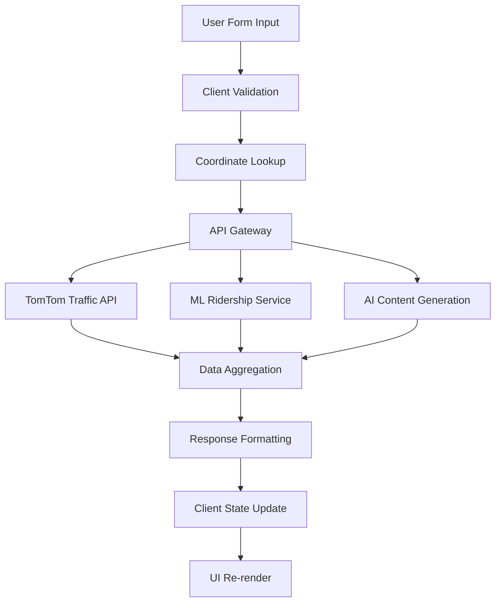
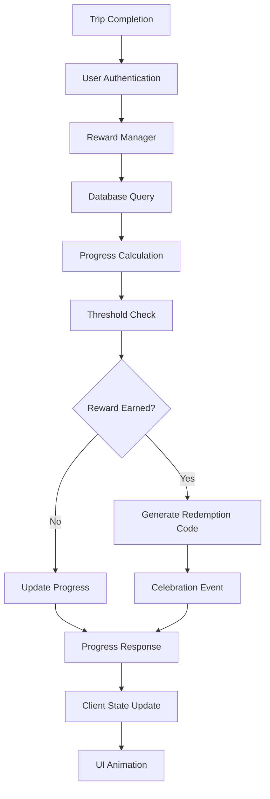
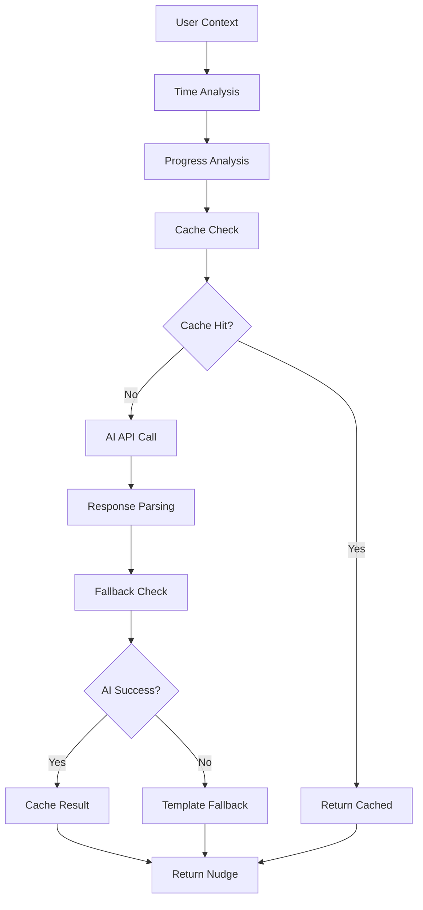

# Kiro Data Flow Architecture - Tryp Transit Application
**Generated:** 2025-08-04 22:32:47  
**Analysis Type:** Data Flow and State Management Analysis

## Data Flow Overview

The Tryp Transit application implements a multi-layered data flow architecture that handles real-time transit data, user interactions, AI-generated content, and reward system state management. The system processes data through several distinct pipelines optimized for different use cases.

## Primary Data Flow Pipelines

### 1. Transit Insights Pipeline



**Data Transformation Steps**:

1. **Input Processing**:
   ```typescript
   // Raw form data
   {
     departureStop: "King St & Meeting St",
     destinationStop: "MUSC - Ashley Ave", 
     arrivalTime: "08:30"
   }
   
   // Transformed to coordinates
   {
     departure: { lat: 32.7767, lng: -79.9311 },
     destination: { lat: 32.7886, lng: -79.9547 },
     timeToDestination: "08:30"
   }
   ```

2. **External Service Integration**:
   ```typescript
   // TomTom API Response Processing
   const trafficData = {
     flow: {
       current: flowResponseCurrent.data,
       destination: flowResponseDestination.data,
     },
     incidents: incidentResponse.data,
     ridership: { predictedHourly: predictedHourlyRidership }
   };
   ```

3. **AI Content Generation**:
   ```typescript
   // Structured prompt for AI
   const prompt = `You are a transit optimization assistant...
   CONTEXT: ${JSON.stringify(trafficData)}
   TASK: Create a JSON response with these exact fields...`;
   
   // AI Response Processing
   const responseObject = JSON.parse(result) as TransitInsightResponse;
   ```

### 2. Rewards System Pipeline



**State Transitions**:

1. **Progress Tracking**:
   ```typescript
   interface UserRewardProgress {
     completedTrips: number;
     requiredTrips: number;
     isEarned: boolean;
     redemptionCode: string | null;
     earnedAt: Date | null;
   }
   ```

2. **Reward Calculation Logic**:
   ```typescript
   const newCompletedTrips = progress.completedTrips + 1;
   const isNowEarned = newCompletedTrips >= progress.reward.requiredTrips;
   
   if (isNowEarned) {
     updateData.isEarned = true;
     updateData.earnedAt = new Date();
     updateData.redemptionCode = this.generateRedemptionCode(progress.reward.rewardType);
   }
   ```

### 3. AI Nudge Generation Pipeline



**Context Building**:
```typescript
interface NudgeContext {
  userId: string;
  userName: string;
  currentProgress: UserRewardProgress[];
  nearbyPartners: Partner[];
  timeOfDay: string;
}

// Beer context enhancement
const beerContext = getBeerNudgeContext();
const beerContextMessage = getBeerContextMessage(beerContext);
```

## State Management Architecture

### 1. Client-Side State Management

#### React Context Providers
```typescript
// Global state hierarchy
<AuthProvider>
  <GeolocationProvider>
    <TravelProvider>
      <Application />
    </TravelProvider>
  </GeolocationProvider>
</AuthProvider>
```

#### Component State Management
```typescript
// Local component state
const [userProgress, setUserProgress] = useState<UserProgress[]>([]);
const [nudgeData, setNudgeData] = useState<GeneratedNudge | null>(null);
const [isLoading, setIsLoading] = useState(false);
const [celebrationReward, setCelebrationReward] = useState<any>(null);
```

### 2. Server-Side State Management

#### Database State
```prisma
// Persistent state in PostgreSQL
model UserRewardProgress {
  completedTrips Int       @default(0)
  isEarned       Boolean   @default(false)
  lastTripDate   DateTime?
  earnedAt       DateTime?
  expiresAt      DateTime?
}
```

#### Service Layer State
```typescript
// Cached state in services
class NudgeGenerator {
  private cache = new Map<string, CachedNudge>();
  private readonly CACHE_TTL = 300000; // 5 minutes
}
```

## Data Synchronization Patterns

### 1. Optimistic Updates
```typescript
// Immediate UI update before API confirmation
const handleTripCompleted = (result: any) => {
  // Update UI immediately
  setUserProgress(prev => updateProgressOptimistically(prev));
  
  // Sync with server
  loadUserData(selectedUserId);
};
```

### 2. Error Recovery
```typescript
// Retry logic with exponential backoff
const handleSubmit = async (e: React.FormEvent, isRetry = false) => {
  try {
    const response = await fetch(apiEndpoint, requestConfig);
    // ... success handling
  } catch (err) {
    if (retryCount < maxRetries) {
      setTimeout(() => {
        handleSubmit(syntheticEvent, true);
      }, 1000 * (retryCount + 1));
    }
  }
};
```

### 3. Cache Invalidation
```typescript
// Service-level cache management
clearCache() {
  this.cache.clear();
  logger.nudgeEvent('cache_cleared', 'system');
}
```

## Data Persistence Layers

### 1. Database Layer (PostgreSQL + Prisma)

#### Schema Design
```prisma
// Relational data structure
model UserRewardProgress {
  id             String    @id @default(cuid())
  userId         String
  rewardId       String
  completedTrips Int       @default(0)
  isEarned       Boolean   @default(false)
  
  // Relations
  user   UserProfile @relation(fields: [userId], references: [id])
  reward Reward      @relation(fields: [rewardId], references: [id])
  
  @@unique([userId, rewardId])
}
```

#### Query Patterns
```typescript
// Complex relational queries
const progress = await prisma.userRewardProgress.findMany({
  where: { userId },
  include: {
    reward: {
      include: { partner: true }
    }
  },
  orderBy: [
    { isEarned: 'asc' },
    { completedTrips: 'desc' }
  ]
});
```

### 2. External Data Sources

#### TomTom Traffic API
```typescript
// Real-time traffic data integration
const flowResponse = await axios.get(
  `https://api.tomtom.com/traffic/services/4/flowSegmentData/absolute/10/json`,
  {
    params: {
      key: TOMTOM_API_KEY,
      point: `${latitude},${longitude}`,
    },
  }
);
```

#### ML Service Integration
```typescript
// Ridership prediction data
const ridershipResponse = await axios.get(
  `${process.env.RIDERSHIP_API_BASE_URL}/predict/hourly/${hours_until_destination}`,
  { timeout: 10000 }
);
```

### 3. File-Based Data (ML Service)

#### CSV Data Processing
```python
# Pandas data loading and processing
df_hourly_raw = pd.read_csv("data/MTA_Bus_Hourly_Ridership__Beginning_February_2022_1000.csv")
df_hourly_raw['transit_timestamp'] = pd.to_datetime(df_hourly_raw['transit_timestamp'])
df_hourly = df_hourly_raw.sort_values('transit_timestamp')
```

## Data Validation and Type Safety

### 1. TypeScript Interface Validation
```typescript
// Compile-time type checking
interface TransitInsightResponse {
  travelTime: number | null;
  trafficDensity: 'Light' | 'Medium' | 'Heavy' | null;
  costSavingsPerTrip: string | null;
  nudgeMessage: string | null;
  incentiveDetails: IncentiveDetails | null;
}
```

### 2. Runtime Validation
```typescript
// API response validation
const requiredFields = ['travelTime', 'trafficDensity', 'costSavingsPerTrip'];
const missingFields = requiredFields.filter(field => !(field in responseObject));

if (missingFields.length > 0) {
  console.warn(`AI response missing fields: ${missingFields.join(', ')}`);
}
```

### 3. Database Constraints
```prisma
// Schema-level validation
enum RewardType {
  ECREDIT
  FREE_COFFEE
  FREE_APPETIZER
  FREE_BEER
}

model Reward {
  rewardType    RewardType // Enum constraint
  requiredTrips Int        // Non-null constraint
}
```

## Performance Optimization Strategies

### 1. Data Loading Optimization

#### Global Model Loading (ML Service)
```python
# Load models once at startup
pipeline_hourly = None
df_hourly = None

def load_hourly_model():
    global pipeline_hourly
    pipeline_hourly = ChronosPipeline.from_pretrained("amazon/chronos-t5-mini")
```

#### Database Query Optimization
```typescript
// Efficient relationship loading
const progress = await prisma.userRewardProgress.findMany({
  where: { userId },
  include: {
    reward: { include: { partner: true } } // Single query with joins
  }
});
```

### 2. Caching Strategies

#### Service-Level Caching
```typescript
// In-memory caching with TTL
private cache = new Map<string, CachedNudge>();
private readonly CACHE_TTL = 300000; // 5 minutes

const cached = this.cache.get(cacheKey);
if (cached && Date.now() - cached.timestamp < this.CACHE_TTL) {
  return cached;
}
```

#### Client-Side Caching
```typescript
// React state as cache
const [userProgress, setUserProgress] = useState<UserProgress[]>([]);
// Avoid unnecessary re-fetches
```

### 3. Lazy Loading and Code Splitting
```typescript
// Dynamic imports for large components
const CelebrationModal = lazy(() => import('./CelebrationModal'));
```

## Error Handling and Data Recovery

### 1. Graceful Degradation
```typescript
// Fallback to mock data when services unavailable
if (pipeline_hourly == "mock" || df_hourly.empty) {
  return generate_realistic_mock_prediction(hours_future);
}
```

### 2. Error Boundary Pattern
```typescript
// Comprehensive error handling
try {
  const result = await apiCall();
  return result;
} catch (error) {
  logger.apiEvent('error', { error: error.message });
  return fallbackData;
}
```

### 3. Data Consistency
```typescript
// Transaction-like operations
const result = await rewardManager.recordTripCompletion(userId);
// All related updates happen atomically
```

## Analytics and Logging Data Flow

### 1. Event Tracking
```typescript
// Structured logging throughout the application
logger.apiEvent('trip_completion_success', { 
  userId, 
  responseTime,
  newRewardsCount: result.newlyEarnedRewards.length
});

logger.beerRewardEvent('earned', userId, { 
  rewardCount: beerRewards.length,
  redemptionCodes: beerRewards.map(r => r.redemptionCode)
});
```

### 2. Performance Monitoring
```typescript
// Response time tracking
const startTime = Date.now();
// ... operation
const responseTime = Date.now() - startTime;
logger.apiEvent('operation_complete', { responseTime });
```

## Data Security and Privacy

### 1. API Key Management
```typescript
// Environment variable protection
const TOMTOM_API_KEY = process.env.NEXT_PUBLIC_TOMTOM_API_KEY;
const GEMINI_API_KEY = process.env.GEMINI_API_KEY;
```

### 2. Data Sanitization
```typescript
// Input validation and sanitization
if (!userId || typeof userId !== 'string') {
  return NextResponse.json({ error: 'Valid userId is required' }, { status: 400 });
}
```

### 3. Minimal Data Storage
```prisma
// Only essential data stored
model UserProfile {
  id        String   @id @default(cuid())
  name      String   // No sensitive personal data
  email     String   @unique
}
```

This data flow architecture demonstrates a well-designed system that handles complex data transformations, maintains consistency across multiple services, and provides robust error handling while optimizing for performance and user experience.